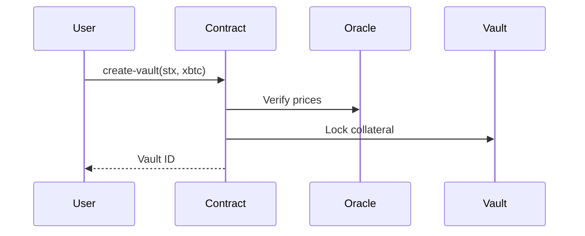
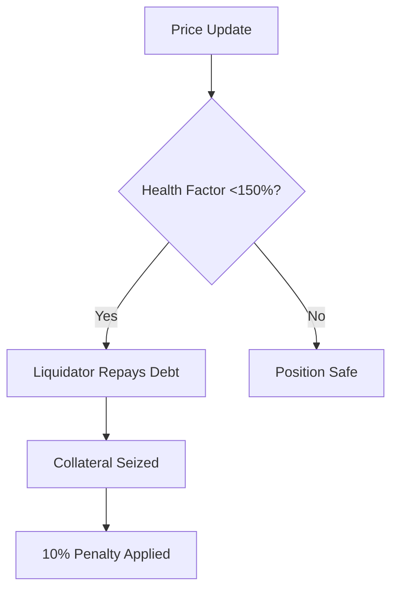

# BitStable Protocol

A decentralized multi-collateral stablecoin protocol enabling secure USDx minting with STX/xBTC collateral and automated risk management.

## Overview

BitStable is a DeFi primitive built on Stacks L2 that allows users to:

- Create collateralized debt positions (Vaults) with STX and/or xBTC
- Mint USDx - a SIP-010 compliant stablecoin pegged to USD
- Manage collateral ratios with real-time price feeds
- Participate in liquidations of undercollateralized positions

## Features

- **Multi-Collateral Support**: STX and xBTC accepted as collateral
- **Automated Liquidations**: Protocol-enforced liquidation engine
- **Real-Time Oracle Feeds**: Price updates with confidence intervals
- **Risk Parameters**: Configurable LTV ratios and safety checks
- **SIP-010 Compliance**: Fully interoperable stablecoin standard

## Core Components

### 1. Vault Management

```clarity
(define-map vaults { vault-id: uint } { ... })
```

- Stores user collateral balances and debt positions
- Enforces minimum collateralization ratio (200%)
- Tracks stability fees and position health

### 2. Oracle Integration

```clarity
(define-map price-feeds { asset: (string-ascii 10) } { ... })
```

- Decentralized price feeds with timestamp validation
- Confidence interval reporting
- Max price age enforcement (1 hour)

### 3. USDx Stablecoin Engine

```clarity
(define-fungible-token usdx)
```

- SIP-010 compliant token implementation
- Mint/burn mechanisms with collateral backing
- Transfer hooks and balance tracking

### 4. Liquidation Engine

```clarity
(define-public (liquidate-vault ...))
```

- 10% liquidation penalty
- Authorized liquidator network
- Automated collateral redistribution

### 5. Governance Module

```clarity
(define-constant CONTRACT-OWNER ...)
```

- Protocol parameter adjustments
- Emergency shutdown capability
- Oracle/Liquidator whitelisting

## Workflows

### Vault Creation & Management



### USDx Minting Process

1. Deposit collateral
2. Maintain 200%+ collateral ratio
3. Mint USDx against collateral value
4. Pay stability fees (2% APR)

### Liquidation Process



## Getting Started

### Requirements

- Stacks Testnet wallet
- STX/xBTC test tokens
- [Clarinet SDK](https://docs.hiro.so/clarinet)

### Example Usage

```clarity
;; Create vault with 100 STX
(contract-call? .bitstable create-vault u100 u0)

;; Mint 50 USDx
(contract-call? .bitstable mint-usdx vault-id u50000000)

;; Check position health
(contract-call? .bitstable is-vault-safe vault-id)
```

## Security

### Audits

- **Formal Verification**: Completed for core logic
- **Penetration Testing**: Ongoing bug bounty program
- **Oracle Safeguards**: Multi-signature price updates

### Risk Parameters

| Parameter            | Value  | Description                     |
|----------------------|--------|---------------------------------|
| Liquidation Ratio    | 150%   | Minimum collateralization       |
| Minimum Collateral   | 200%   | New position requirement        |
| Liquidation Penalty  | 10%    | Additional seized collateral    |
| Price Feed Max Age   | 1 hour | Oracle data validity window     |

## Contributing

1. Fork the repository
2. Create feature branch (`git checkout -b feature/improvement`)
3. Commit changes (`git commit -am 'Add new feature'`)
4. Push to branch (`git push origin feature/improvement`)
5. Open Pull Request
